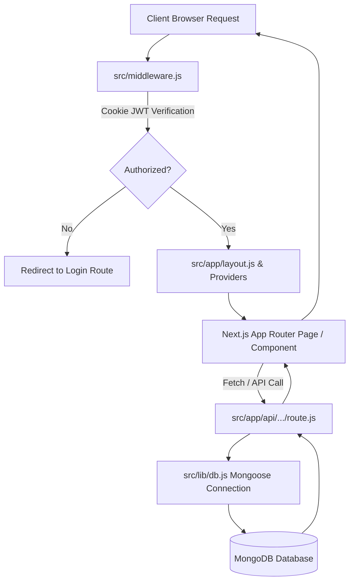

# Joamex Web - Project Workflow & Next.js Architecture Guide

Yeh document **Joamex Web Application** ka complete workflow, Next.js architecture, data flow, API endpoints, and role-based access control (RBAC) explain karta hai.

---

## 📐 1. Next.js 16 (App Router) Execution & Data Flow

Application **Next.js 16 App Router (`src/app`)** me architecture hai. Browser request se leke database response tak ka complete request cycle is prakar hai:

### Request Processing Steps:
1. **Middleware Check (`src/middleware.js`)**:
   - Request sabse pehle `middleware.js` se guzarti hai.
   - Cookies se JWT tokens padhe jaate hain:
     - `user_token` -> Customer routes (`/profile`, `/cart`)
     - `partner_token` -> Partner routes (`/partner/*`)
     - `admin_token` -> Admin routes (`/admin/*`)
   - NextAuth session token ko bhi safely check kiya jata hai.
   - Unauthorized requests ko respective login pages (`/login`, `/partner/login`, `/admin/login`) par redirect kar diya jata hai.

2. **Root Layout & Context Providers (`src/app/layout.js` & `src/components/Providers.js`)**:
   - Application root layout fonts aur global CSS ([globals.css](file:///d:/OFFICE/joamex-web-main/src/app/globals.css)) inject karta hai.
   - `Providers.js` app ko wrapper providers deta hai:
     - `SessionProvider`: NextAuth (Google/Social login) ke liye.
     - `CartProvider` ([CartContext.js](file:///d:/OFFICE/joamex-web-main/src/context/CartContext.js)): Shopping cart, items calculation, local storage persistence manage karne ke liye.
     - `ToastContainer`: Real-time UI alerts ke liye.

3. **Database Connection (`src/lib/db.js`)**:
   - MongoDB se Mongoose ke through single-cached connection maintain hota hai taaki serverless environment me unnecessary connection creation se bacha ja sake.

4. **Authentication Helper (`src/lib/auth.js`)**:
   - `jose` library use karke `signJWT` aur `verifyJWT` se HMAC-SHA256 JWT tokens sign aur verify kiye jaate hain.

---

## 👥 2. Role-Based Workflows

### 🔵 Customer Workflow (User Portal)
- **Services Browsing**: Users home page (`/`) ya individual categories like AC Repair (`/ac-repair`), Electrician (`/electrician`), Plumber (`/plumber`), Appliance (`/appliance`) explore karte hain.
- **Authentication**: 
  - Mobile OTP (`POST /api/auth/otp` & `POST /api/auth/verify-otp`)
  - Email OTP / Quick Login / Password Login (`POST /api/auth/login`)
  - Google Social Login via NextAuth.
  - Successfully auth hone par `user_token` HTTP cookie set hoti hai.
- **Cart & Checkout**:
  - Services cart me add hoti hain (`CartContext`).
  - Checkout page (`/cart`) par date, time slot, aur address select hota hai.
  - Order place hone par `POST /api/bookings` call hota hai.
- **Manage Bookings**: Profile page (`/profile`) par current and past bookings track aur cancel ki ja sakti hain.

---

### 🟢 Partner Workflow (Service Technician Portal)
- **Registration**: Service technician `/partner/register` page par apni details (Name, Phone, Email, Service Category, City) submit karke register karta hai.
- **Authentication**: `/partner/login` par OTP verify karke authenticate hota hai (`partner_token` cookie set hoti hai).
- **Partner Dashboard (`/partner/dashboard`)**:
  - Technician ko unki category ki naye service requests aur assigned jobs show hoti hain.
  - Service Status Update System:
    - `Pending` ➔ `Accepted` ➔ `In Progress` ➔ `Completed`

---

### 🔴 Admin Workflow (Platform Management Portal)
- **Admin Security**: `/admin` routes require `admin_token` with payload `role === 'admin'`.
- **Admin Dashboard (`/admin/dashboard`)**:
  - **Overview & Stats**: Platform totals, active bookings, user/partner counts (`GET /api/admin/stats`).
  - **Partner Management**: New partner registrations review, approve, ya block karna (`/api/admin/partners`).
  - **User Management**: User accounts monitor karna (`/api/admin/users`).
  - **Financial Reports**: Platform revenue aur booking transactions breakdown (`/api/admin/financials`).
  - **System Settings**: Platform config update karna (`/api/admin/settings`).

---

## 🗄️ 3. Data Models (Mongoose Schemas)

| Model File | Main Fields | Purpose |
| :--- | :--- | :--- |
| **User.js** ([User.js](file:///d:/OFFICE/joamex-web-main/src/models/User.js)) | `name`, `phone`, `email`, `password`, `addresses`, `role` | Customer records and addresses |
| **Partner.js** ([Partner.js](file:///d:/OFFICE/joamex-web-main/src/models/Partner.js)) | `name`, `phone`, `email`, `category`, `city`, `status`, `isVerified` | Technician profile and service status |
| **Booking.js** ([Booking.js](file:///d:/OFFICE/joamex-web-main/src/models/Booking.js)) | `userId`, `partnerId`, `services`, `totalAmount`, `status`, `scheduledDate`, `slot`, `address` | Service orders & lifecycle state |
| **Admin.js** ([Admin.js](file:///d:/OFFICE/joamex-web-main/src/models/Admin.js)) | `name`, `email`, `password`, `role` | Platform admin accounts |
| **Otp.js** / **EmailOtp.js** | `phone`/`email`, `otp`, `createdAt` | OTP verification with TTL auto-expiry |
| **SystemConfig.js** | `key`, `value` | Platform dynamic configuration settings |

---

## 🔌 4. Core API Endpoints

### 🔑 Authentication APIs (`/api/auth`)
- `POST /api/auth/otp`: Generate & send mobile OTP.
- `POST /api/auth/verify-otp`: Verify mobile OTP & issue `user_token`.
- `POST /api/auth/login`: Email/Password login.
- `POST /api/auth/signup`: User registration.
- `GET /api/auth/me`: Get current logged-in user profile.
- `POST /api/auth/logout`: Clear authentication cookies.

### 📅 Booking APIs (`/api/bookings`)
- `POST /api/bookings`: Create a new home service booking.
- `GET /api/bookings`: Fetch bookings for current user or partner.

### 🛠️ Partner APIs (`/api/partner`)
- `POST /api/partner/register`: Partner application submission.
- `POST /api/partner/send-otp` & `/verify-otp`: Partner auth.
- `GET /api/partner/me`: Fetch technician profile & assigned tasks.
- `PUT /api/partner/update`: Update partner job status / details.

### 🛡️ Admin APIs (`/api/admin`)
- `GET /api/admin/stats`: Get dashboard platform metrics.
- `GET /api/admin/users`: List & manage customer accounts.
- `GET /api/admin/partners`: List & manage partners.
- `GET /api/admin/financials`: Revenue and payment reports.
- `POST /api/admin/settings`: Modify system config.

---

## 📂 5. Directory Reference

- **`src/app/`**: Next.js App Router pages and API routes.
- **`src/components/`**: UI Layouts, headers, footers, service cards, category sections.
- **`src/context/`**: React Context ([CartContext.js](file:///d:/OFFICE/joamex-web-main/src/context/CartContext.js)).
- **`src/lib/`**: Core utilities ([db.js](file:///d:/OFFICE/joamex-web-main/src/lib/db.js), [auth.js](file:///d:/OFFICE/joamex-web-main/src/lib/auth.js), [email.js](file:///d:/OFFICE/joamex-web-main/src/lib/email.js)).
- **`src/models/`**: MongoDB Mongoose Schemas.
- **`src/middleware.js`**: Edge authorization middleware for route protection.
